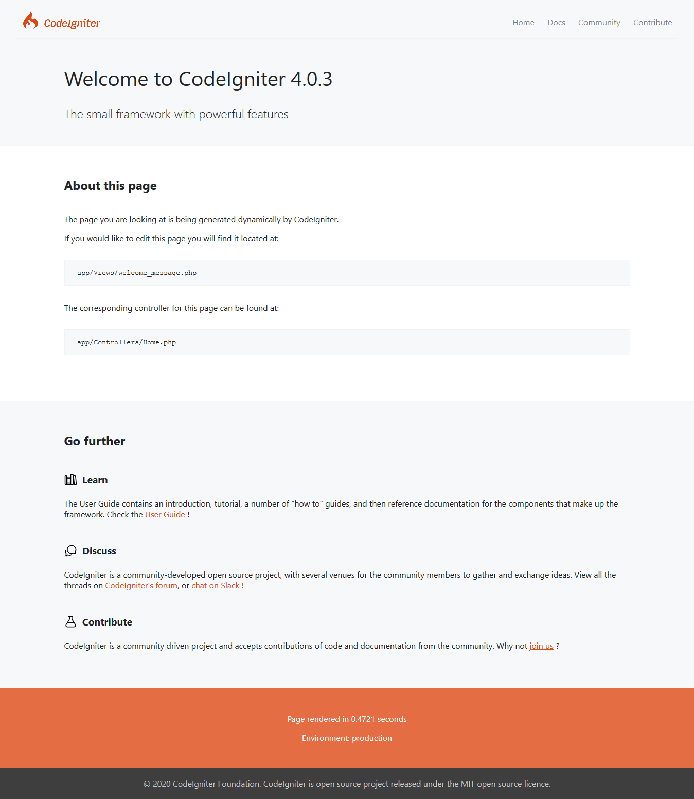

###############
Troubleshooting
###############

Here are some common installation problems, and suggested workarounds.

How do I know if my install is working?
------------------------------------------------------------------------

From the command line, at your project root::

    php spark serve

``http://localhost:8080`` in your browser should then show the default
welcome page:

|CodeIgniter4 Welcome|

I have to include index.php in my URL
-------------------------------------

If a URL like ``/mypage/find/apple`` doesn't work, but the similar
URL ``/index.php/mypage/find/apple`` does, that sounds like your ``.htaccess`` rules
(for Apache) are not set up properly, or the ``mod_rewrite`` extension
in Apache's ``httpd.conf`` is commented out.

Only the default page loads
---------------------------

If you find that no matter what you put in your URL only your default
page is loading, it might be that your server does not support the
REQUEST_URI variable needed to serve search-engine friendly URLs. As a
first step, open your *app/Config/App.php* file and look for
the URI Protocol information. It will recommend that you try a couple of
alternate settings. If it still doesn't work after you've tried this
you'll need to force CodeIgniter to add a question mark to your URLs. To
do this open your *app/Config/App.php* file and change this::

	public $indexPage = 'index.php';

To this::

	public $indexPage = 'index.php?';

The tutorial gives 404 errors everywhere :(
-------------------------------------------

You can't follow the tutorial using PHP's built-in web server.
It doesn't process the `.htaccess` file needed to route
requests properly.

The solution: use Apache to serve your site, or else the built-in
CodeIgniter equivalent, ``php spark serve`` from your project root.

What's with an unhelpful "Whoops!" page?
------------------------------------------------------

You find that your app is displaying a page with "Whoops!" and
then the text line "We seem to have hit a snag. Please try again later...".

That is a sign that you are in production mode and have hit an
unrecoverable error, which we don't want to show to the viewer of
the webapp, for better security.

You can see the error in the debug toolbar display by setting your environment to
"development" (in `.env`), and reloading the page.

Don't forget to reset the environment to "production" once you fix the problem!

CodeIgniter Error Logs
-------------------------------------------------------

CodeIgniter logs error messages, according to the settings in `app/Config/Logger.php`.

You can adjust the error threshold to see more or fewer messages.

The default configuration has daily log files stored in `writable/logs`.
It would be a good idea to check them if things aren't working the way you expect!
