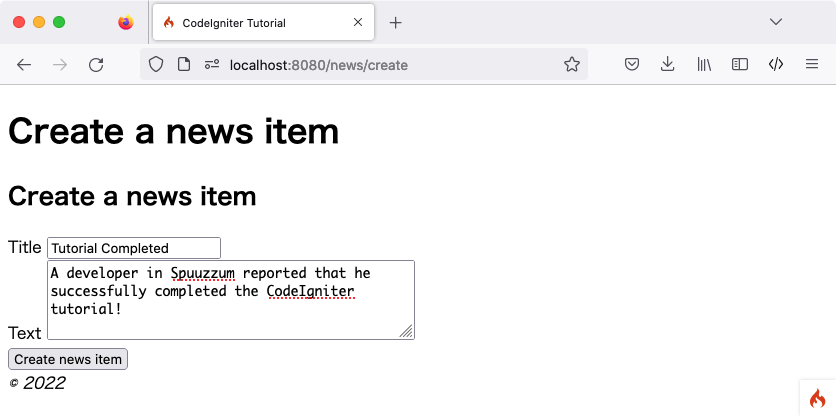
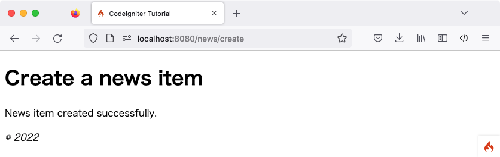
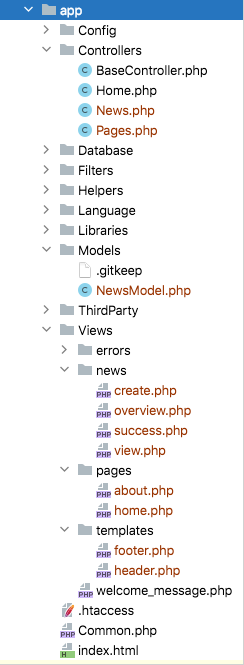

Create news items
###############################################################################

You now know how you can read data from a database using CodeIgniter, but
you haven't written any information to the database yet. In this section,
you'll expand your news controller and model created earlier to include
this functionality.

Create a form
-------------------------------------------------------

To input data into the database, you need to create a form where you can
input the information to be stored. This means you'll be needing a form
with two fields, one for the title and one for the text. You'll derive
the slug from our title in the model. Create a new view at
**app/Views/news/create.php**.

::

    <h2><?= esc($title); ?></h2>

    <?= \Config\Services::validation()->listErrors(); ?>

    <form action="/news/create">

        <label for="title">Title</label>
        <input type="input" name="title" /> 

        <label for="body">Text</label>
        <textarea name="body"></textarea> 

        <input type="submit" name="submit" value="Create news item" />

    </form>

There is only one thing here that probably look unfamiliar to you: the 
``\Config\Services::validation()->listErrors()`` function. It is used to report
errors related to form validation.

Go back to your ``News`` controller. You're going to do two things here,
check whether the form was submitted and whether the submitted data
passed the validation rules. You'll use the :doc:`form
validation <../libraries/validation>` library to do this.

::

    public function create()
    {
        helper('form');
        $model = new NewsModel();

        if (! $this->validate([
            'title' => 'required|min_length[3]|max_length[255]',
            'body'  => 'required'
        ]))
        {
            echo view('templates/header', ['title' => 'Create a news item']);
            echo view('news/create');
            echo view('templates/footer');

        }
        else
        {
            $model->save([
                'title' => $this->request->getVar('title'),
                'slug'  => url_title($this->request->getVar('title')),
                'body'  => $this->request->getVar('body'),
            ]);
            echo view('news/success');
        }
    }

The code above adds a lot of functionality. The first few lines load the
form helper and the NewsModel. After that, the Controller-provided helper
function is used to validate the $_POST fields. In this case, the title and
text fields are required.

CodeIgniter has a powerful validation library as demonstrated
above. You can read :doc:`more about this library
here <../libraries/validation>`.

Continuing down, you can see a condition that checks whether the form
validation ran successfully. If it did not, the form is displayed; if it
was submitted **and** passed all the rules, the model is called. This
takes care of passing the news item into the model.
This contains a new function, url\_title(). This function -
provided by the :doc:`URL helper <../helpers/url_helper>` - strips down
the string you pass it, replacing all spaces by dashes (-) and makes
sure everything is in lowercase characters. This leaves you with a nice
slug, perfect for creating URIs.

After this, a view is loaded to display a success message. Create a view at
**app/Views/news/success.php** and write a success message. 

This could be as simple as:::

    News item created successfully. 

Model Updating
-------------------------------------------------------

The only thing that remains is ensuring that your model is setup
to allow data to be saved properly. The ``save()`` method that was
used will determine whether the information should be inserted
or if the row already exists and should be updated, based on the presence
of a primary key. In this case, there is no ``id`` field passed to it,
so it will insert a new row into it's table, **news**.

However, by default the insert and update methods in the model will
not actually save any data because it doesn't know what fields are
safe to be updated. Edit the model to provide it a list of updatable
fields in the ``$allowedFields`` property.

::

    <?php namespace App\Models;
    use CodeIgniter\Model;

    class NewsModel extends Model
    {
        protected $table = 'news';

        protected $allowedFields = ['title', 'slug', 'body'];
    }

This new property now contains the fields that we allow to be saved to the
database. Notice that we leave out the ``id``? That's because you will almost
never need to do that, since it is an auto-incrementing field in the database.
This helps protect against Mass Assignment Vulnerabilities. If your model is
handling your timestamps, you would also leave those out.

Routing
-------------------------------------------------------

Before you can start adding news items into your CodeIgniter application
you have to add an extra rule to **app/Config/Routes.php** file. Make sure your
file contains the following. This makes sure CodeIgniter sees 'create'
as a method instead of a news item's slug.

::

    $routes->match(['get', 'post'], 'news/create', 'News::create');
    $routes->get('news/(:segment)', 'News::view/$1');
    $routes->get('news', 'News::index');
    $routes->get('(:any)', 'Pages::view/$1');

Now point your browser to your local development environment where you
installed CodeIgniter and add ``/news/create`` to the URL.
Add some news and check out the different pages you made.

 

Congratulations
-------------------------------------------------------

You just completed your first CodeIgniter4 application!

The image to the left shows your project's **app** folder,
with all of the files that you created in green.
The two modified configuration files (Database & Routes) are not shown.
