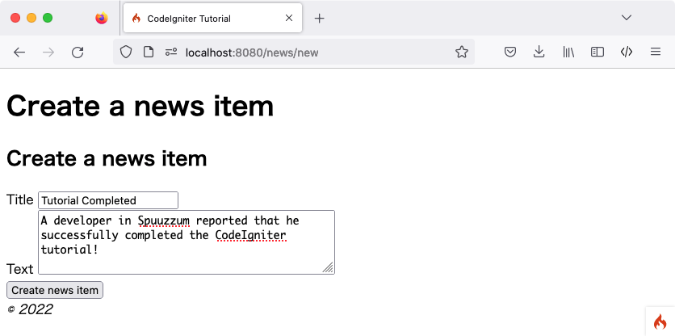

Create News Items
#################

.. contents::
    :local:
    :depth: 2

You now know how you can read data from a database using CodeIgniter, but
you haven't written any information to the database yet. In this section,
you'll expand your news controller and model created earlier to include
this functionality.

Enable CSRF Filter
******************

Before creating a form, let's enable the CSRF protection.

Open the **app/Config/Filters.php** file and update the ``$methods`` property like the following:

.. literalinclude:: create_news_items/001.php

It configures the CSRF filter to be enabled for all **POST** requests.
You can read more about the CSRF protection in :doc:`Security <../libraries/security>` library.

.. Warning:: In general, if you use ``$methods`` filters, you should :ref:`disable Auto Routing (Legacy) <use-defined-routes-only>`
    because :ref:`auto-routing-legacy` permits any HTTP method to access a controller.
    Accessing the controller with a method you don't expect could bypass the filter.

Create a Form
*************

View
====

To input data into the database, you need to create a form where you can
input the information to be stored. This means you'll be needing a form
with two fields, one for the title and one for the text. You'll derive
the slug from our title in the model. Create a new view at
**app/Views/news/create.php**::

    <h2><?= esc($title) ?></h2>

    <?= session()->getFlashdata('error') ?>
    <?= validation_list_errors() ?>

    <form action="/news/create" method="post">
        <?= csrf_field() ?>

        <label for="title">Title</label>
        <input type="input" name="title" value="<?= set_value('title') ?>">
         

        <label for="body">Text</label>
        <textarea name="body" cols="45" rows="4"><?= set_value('body') ?></textarea>
         

        <input type="submit" name="submit" value="Create news item">
    </form>

There are probably only four things here that look unfamiliar.

The :php:func:`session()` function is used to get the Session object,
and ``session()->getFlashdata('error')`` is used to display the error related to CSRF protection
to the user. However, by default, if a CSRF validation check fails, an exception will be thrown,
so it does not work yet. See :ref:`csrf-redirection-on-failure` for more information.

The :php:func:`validation_list_errors()` function provided by the :doc:`../helpers/form_helper`
is used to report errors related to form validation.

The :php:func:`csrf_field()` function creates a hidden input with a CSRF token that helps protect against some common attacks.

The :php:func:`set_value()` function provided by the :doc:`../helpers/form_helper` is used to show
old input data when errors occur.

Controller
==========

Go back to your **News** controller. You're going to do two things here,
check whether the form was submitted and whether the submitted data
passed the validation rules.
You'll use the :ref:`validation method in Controller <controller-validatedata>` to do this.

.. literalinclude:: create_news_items/002.php

The code above adds a lot of functionality.

First we load the :doc:`Form helper <../helpers/form_helper>` with the :php:func:`helper()` function.
Most helper functions require the helper to be loaded before use.

Next, we check if we deal with the **POST** request with the
:doc:`IncomingRequest <../incoming/incomingrequest>` object ``$this->request``.
It is set in the controller by the framework.
The :ref:`IncomingRequest::is() <incomingrequest-is>` method checks the type of the request.
Since the route for **create()** endpoint handles both: **GET** and **POST** requests we can safely assume that if the request is not POST then it is a GET type.
the form is loaded and returned to display.

Then, we get the necessary items from the POST data by the user and set them in the ``$post`` variable.
We also use the :doc:`IncomingRequest <../incoming/incomingrequest>` object ``$this->request``.

After that, the Controller-provided helper function :ref:`validateData() <controller-validatedata>`
is used to validate ``$post`` data.
In this case, the title and body fields are required and in the specific length.
CodeIgniter has a powerful validation library as demonstrated
above. You can read more about the :doc:`Validation library <../libraries/validation>`.

If the validation fails, the form is loaded and returned to display.

If the validation passed all the rules, the **NewsModel** is loaded and called. This
takes care of passing the news item into the model. The :ref:`model-save` method handles
inserting or updating the record automatically, based on whether it finds an array key
matching the primary key.

This contains a new function :php:func:`url_title()`. This function -
provided by the :doc:`URL helper <../helpers/url_helper>` - strips down
the string you pass it, replacing all spaces by dashes (``-``) and makes
sure everything is in lowercase characters. This leaves you with a nice
slug, perfect for creating URIs.

After this, view files are loaded and returned to display a success message. Create a view at
**app/Views/news/success.php** and write a success message.

This could be as simple as::

    
News item created successfully.

Model Updating
**************

The only thing that remains is ensuring that your model is set up
to allow data to be saved properly. The ``save()`` method that was
used will determine whether the information should be inserted
or if the row already exists and should be updated, based on the presence
of a primary key. In this case, there is no ``id`` field passed to it,
so it will insert a new row into it's table, **news**.

However, by default the insert and update methods in the Model will
not actually save any data because it doesn't know what fields are
safe to be updated. Edit the **NewsModel** to provide it a list of updatable
fields in the ``$allowedFields`` property.

.. literalinclude:: create_news_items/003.php

This new property now contains the fields that we allow to be saved to the
database. Notice that we leave out the ``id``? That's because you will almost
never need to do that, since it is an auto-incrementing field in the database.
This helps protect against Mass Assignment Vulnerabilities. If your model is
handling your timestamps, you would also leave those out.

Routing
*******

Before you can start adding news items into your CodeIgniter application
you have to add an extra rule to **app/Config/Routes.php** file. Make sure your
file contains the following. This makes sure CodeIgniter sees ``create()``
as a method instead of a news item's slug. You can read more about different
routing types in :doc:`../incoming/routing`.

.. literalinclude:: create_news_items/004.php

Now point your browser to your local development environment where you
installed CodeIgniter and add ``/news/create`` to the URL.
Add some news and check out the different pages you made.

.. image:: ../images/tutorial4.png
    :align: center
    :height: 415px
    :width: 45%

Congratulations
***************

You just completed your first CodeIgniter4 application!

The image underneath shows your project's **app** folder,
with all of the files that you created in red.
The two modified configuration files (**Config/Routes.php** & **Config/Filters.php**) are not shown.

.. image:: ../images/tutorial9.png
    :align: left
