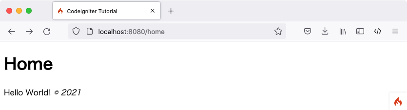

Static Pages
############

.. note:: This tutorial assumes you've downloaded CodeIgniter and
   :doc:`installed the framework <../installation/index>` in your
   development environment.

The first thing you're going to do is set up a **controller** to handle
static pages. A controller is simply a class that helps delegate work.
It is the glue of your web application.

Let's Make our First Controller
*******************************

Create a file at **app/Controllers/Pages.php** with the following
code.

.. literalinclude:: static_pages/001.php

You have created a class named ``Pages``, with a ``view()`` method that accepts
one argument named ``$page``. It also has an ``index()`` method, the same
as the default controller found in **app/Controllers/Home.php**; that method
displays the CodeIgniter welcome page.

.. note:: There are two ``view()`` functions referred to in this tutorial.
    One is the class method created with ``public function view($page = 'home')``
    and ``return view('welcome_message')`` for displaying a view.
    Both are *technically* a function. But when you create a function in a class,
    it's called a method.

The ``Pages`` class is extending the ``BaseController`` class that extends the
``CodeIgniter\Controller`` class. This means that the new Pages class can access the
methods and properties defined in the ``CodeIgniter\Controller`` class
(**system/Controller.php**).

The **controller is what will become the center of every request** to
your web application. Like any PHP class, you refer to
it within your controllers as ``$this``.

Now that you've created your first method, it's time to make some basic page
templates. We will be creating two "views" (page templates) that act as
our page footer and header.

Create the header at **app/Views/templates/header.php** and add
the following code::

    <!doctype html>
    <html>
    <head>
        <title>CodeIgniter Tutorial</title>
    </head>
    <body>

        <h1><?= esc($title) ?></h1>

The header contains the basic HTML code that you'll want to display
before loading the main view, together with a heading. It will also
output the ``$title`` variable, which we'll define later in the controller.
Now, create a footer at **app/Views/templates/footer.php** that
includes the following code::

        <em>&copy; 2021</em>
    </body>
    </html>

.. note:: If you look closely in **header.php** template we are using an ``esc()``
    function. It's a global function provided by CodeIgniter to help prevent
    XSS attacks. You can read more about it :doc:`here </general/common_functions>`.

Adding Logic to the Controller
******************************

Earlier you set up a controller with a ``view()`` method. The method
accepts one parameter, which is the name of the page to be loaded. The
static page bodies will be located in the **app/Views/pages/**
directory.

In that directory, create two files named **home.php** and **about.php**.
Within those files, type some text - anything you'd like - and save them.
If you like to be particularly un-original, try "Hello World!".

In order to load those pages, you'll have to check whether the requested
page actually exists. This will be the body of the ``view()`` method
in the ``Pages`` controller created above:

.. literalinclude:: static_pages/002.php

Now, when the requested page does exist, it is loaded, including the header and
footer, and displayed to the user. If the requested page doesn't exist, a "404
Page not found" error is shown.

The first line in this method checks whether the page actually exists.
PHP's native ``is_file()`` function is used to check whether the file
is where it's expected to be. The ``PageNotFoundException`` is a CodeIgniter
exception that causes the default error page to show.

In the header template, the ``$title`` variable was used to customize the
page title. The value of title is defined in this method, but instead of
assigning the value to a variable, it is assigned to the title element
in the ``$data`` array.

The last thing that has to be done is loading the views in the order
they should be displayed. The ``view()`` function built-in to
CodeIgniter will be used to do this. The second parameter in the ``view()``
function is used to pass values to the view. Each value in the ``$data`` array
is assigned to a variable with the name of its key. So the value of
``$data['title']`` in the controller is equivalent to ``$title`` in the
view.

.. note:: Any files and directory names passed into the ``view()`` function MUST
    match the case of the actual directory and file itself or the system will
    throw errors on case-sensitive platforms. You can read more about it
    :doc:`here </outgoing/views>`.

Routing
*******

We have made the controller. The next thing is to set routing rules.
Routing associates a URI with a controller's method.

Let's do that. Open the routing file located at
**app/Config/Routes.php** and look for the "Route Definitions"
section of the configuration file.

The only uncommented line there to start with should be:

.. literalinclude:: static_pages/003.php

This directive says that any incoming request without any content
specified should be handled by the ``index()`` method inside the ``Home`` controller.

Add the following lines, **after** the route directive for '/'.

.. literalinclude:: static_pages/004.php
   :lines: 2-

CodeIgniter reads its routing rules from top to bottom and routes the
request to the first matching rule. Each rule is a regular expression
(left-side) mapped to a controller and method name separated by slashes
(right-side). When a request comes in, CodeIgniter looks for the first
match, and calls the appropriate controller and method, possibly with
arguments.

More information about routing can be found in the URI Routing
:doc:`documentation </incoming/routing>`.

Here, the second rule in the ``$routes`` object matches GET request
to the URI path ``/pages`` maps the ``index()`` method of the ``Pages`` class.

The third rule in the ``$routes`` object matches GET request to **any** URI path
using the wildcard string ``(:any)``, and passes the parameter to the
``view()`` method of the ``Pages`` class.

Running the App
***************

Ready to test? You cannot run the app using PHP's built-in server,
since it will not properly process the ``.htaccess`` rules that are provided in
``public``, and which eliminate the need to specify "index.php/"
as part of a URL. CodeIgniter has its own command that you can use though.

From the command line, at the root of your project::

    > php spark serve

will start a web server, accessible on port 8080. If you set the location field
in your browser to ``localhost:8080``, you should see the CodeIgniter welcome page.

Now visit ``localhost:8080/home``. Did it get routed correctly to the ``view()``
method in the ``Pages`` controller? Awesome!

You should see something like the following:

You can now try several URLs in the browser location field, to see what the ``Pages``
controller you made above produces...

.. table::
    :widths: 20 80

    +---------------------------------+-----------------------------------------------------------------+
    | URL                             | Will show                                                       |
    +=================================+=================================================================+
    | localhost:8080/                 | the CodeIgniter "welcome" page. the results from the ``index()``|
    |                                 | method in the ``Home`` controller.                              |
    +---------------------------------+-----------------------------------------------------------------+
    | localhost:8080/pages            | the results from the ``index()`` method inside our ``Pages``    |
    |                                 | controller, which is to display the CodeIgniter "welcome" page. |
    +---------------------------------+-----------------------------------------------------------------+
    | localhost:8080/home             | show the "home" page that you made above, because we explicitly |
    |                                 | asked for it. the results from the ``view()`` method inside our |
    |                                 | ``Pages`` controller.                                           |
    +---------------------------------+-----------------------------------------------------------------+
    | localhost:8080/about            | the "about" page that you made above, because we explicitly     |
    |                                 | asked for it.                                                   |
    +---------------------------------+-----------------------------------------------------------------+
    | localhost:8080/shop             | a "404 - File Not Found" error page, because there is no        |
    |                                 | **app/Views/pages/shop.php**.                                   |
    +---------------------------------+-----------------------------------------------------------------+
